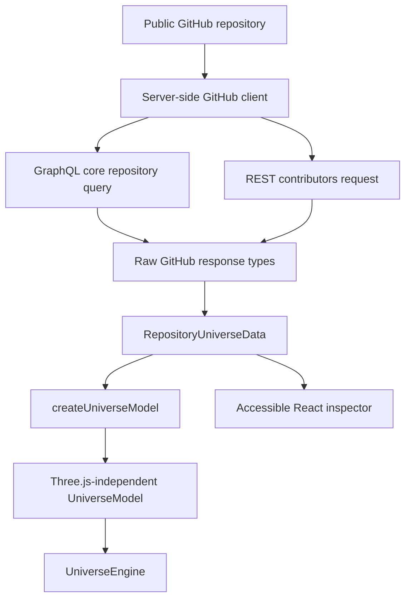

# Repo Universe

<div align="center">
  

**Every repository has a universe.**

Turn any public GitHub repository into an explorable, deterministic 3D solar system generated from real repository data.

`Next.js` · `React` · `TypeScript` · `Three.js` · `GitHub GraphQL + REST`

</div>

---

Repo Universe is a visual exploration tool for public GitHub repositories. Instead of presenting repository metadata as another analytics dashboard, it translates a carefully selected subset of that data into a spatial model you can orbit, inspect, and share.

The repository becomes a star. Dominant languages become planets. Contributor activity appears as signals around the outer system. Fork volume shapes an asteroid belt. Metrics that do not map cleanly to a celestial metaphor stay as readable data in the inspector.

The result is designed to answer one question:

> **What does this repository's universe look like?**

## Contents

* [Experience](#experience)
* [Repository-to-universe model](#repository-to-universe-model)
* [Data coverage](#data-coverage)
* [Architecture](#architecture)
* [GitHub data layer](#github-data-layer)
* [Deterministic generation](#deterministic-generation)
* [Rendering engine](#rendering-engine)
* [Graphics quality](#graphics-quality)
* [Performance](#performance)
* [Accessibility](#accessibility)
* [Privacy and security](#privacy-and-security)
* [Getting started](#getting-started)
* [Environment variables](#environment-variables)
* [Scripts](#scripts)
* [Project structure](#project-structure)
* [Technology](#technology)
* [Routes and metadata](#routes-and-metadata)
* [Failure handling](#failure-handling)
* [Deployment](#deployment)
* [Limitations](#limitations)

## Experience

Repo Universe is built as a full-screen spatial interface rather than a dashboard containing a 3D widget.

### Explore any public repository

Both forms resolve to the same canonical universe:

```text
vercel/next.js
```

```text
https://github.com/vercel/next.js
```

Repository input is normalized to an `owner/repository` identity before any GitHub request is made.

### Navigate the system

The universe supports:

* orbital camera movement
* zoom and pan
* raycast hover and selection
* object focus with camera transitions
* camera reset
* pause and resume
* `Auto`, `High`, and `Low` graphics modes
* desktop inspector and mobile bottom-sheet inspection
* Web Share API with clipboard fallback
* reduced-motion behavior
* WebGL failure fallback

### Inspect real repository data

The interface exposes repository information independently from the canvas, including:

* stars and forks
* open issues and pull requests
* repository description
* dominant languages
* contributor information
* activity score
* default branch
* repository size
* created and last-push dates
* license
* latest release
* topics
* archived state
* fork / parent relationship when available

## Repository-to-universe model

The visual mapping is intentionally limited. Repo Universe does not invent a celestial metaphor for every GitHub metric.

| Repository data     | Universe representation    | Scaling / behavior                       |
| ------------------- | -------------------------- | ---------------------------------------- |
| Repository          | Central star               | Primary object in the system             |
| Stars               | Star brightness and corona | Logarithmic scaling                      |
| Recent activity     | Surface energy and pulse   | Exponential time decay                   |
| Primary language    | Star tint                  | GitHub language color when available     |
| Dominant languages  | Planets                    | Up to 8 planets                          |
| Language bytes      | Planet size                | Square-root-style nonlinear scaling      |
| Language color      | Planet color               | GitHub color with deterministic fallback |
| Contributors        | Outer-system signals       | Top contributors, log-scaled intensity   |
| Forks               | Asteroid belt density      | Logarithmic, bounded instance count      |
| Repository identity | Structural seed            | Stable hash + seeded PRNG                |

Metrics such as issues, pull requests, release information, branch name, license, topics, dates, and repository size remain normal inspector data because that representation is clearer and less misleading.

## Data coverage

Repo Universe intentionally uses a bounded dataset. The goal is to keep large repositories readable and performant instead of trying to mirror every GitHub record into the scene.

> [!IMPORTANT]
> A repository can contain more languages, topics, or contributors than Repo Universe displays. The application communicates these limits in the inspector so the visualization is not mistaken for a complete GitHub dataset.

Current limits:

| Data                       |                  Loaded |                Rendered in 3D |
| -------------------------- | ----------------------: | ----------------------------: |
| Dominant languages         |                 Up to 8 |               Up to 8 planets |
| Repository topics          |                Up to 20 |                Inspector only |
| Non-anonymous contributors |               Up to 100 |              Up to 18 signals |
| Fork-derived asteroids     | Derived from fork count | 20-120 before quality scaling |

Contributor behavior is deliberately split into two layers:

1. GitHub REST loads up to 100 non-anonymous contributors for inspection.
2. The 3D scene renders at most 18 contributor signals.

This prevents repositories with hundreds or thousands of contributors from turning the visualization into an unreadable particle cloud while still exposing a substantially larger contributor set in the inspector.

## Architecture

The application keeps API data, product-domain data, and rendering data separate.



### Boundary rules

* GitHub API calls run on the server.
* GitHub response objects are normalized before reaching product UI or graphics code.
* Three.js consumes a renderer-independent universe model.
* React owns interface state.
* `UniverseEngine` owns scene and rendering state.
* Continuous render values do not flow through React state every frame.

This separation keeps the deterministic mapping testable without WebGL and prevents GitHub API structure from leaking into the renderer.

## GitHub data layer

Repo Universe uses a small server-side request surface.

### GraphQL

A single GraphQL repository query retrieves the core dataset used by the application:

* repository identity and description
* stars and forks
* issues and pull requests
* created, updated, and pushed timestamps
* repository disk usage
* archive and fork state
* owner information
* default branch
* license
* up to 20 topics
* latest release
* up to 8 dominant languages
* parent repository information

### REST

The contributors endpoint is requested separately because contributor data fits the REST API well:

```text
GET /repos/{owner}/{repo}/contributors?per_page=100&anon=0
```

The REST client currently sends:

```text
Accept: application/vnd.github+json
X-GitHub-Api-Version: 2026-03-10
User-Agent: repo-universe
```

### Cache policy

Next.js Cache Components are enabled with separate cache profiles:

| Dataset         | Stale | Revalidate | Expire |
| --------------- | ----: | ---------: | -----: |
| Repository core | 5 min |     30 min |   24 h |
| Contributors    | 5 min |     60 min |   24 h |

There is no polling. Camera movement, object selection, inspector interaction, and canvas rendering do not trigger additional GitHub requests.

## Deterministic generation

A repository should have an identity, not a different random layout on every refresh.

Repo Universe derives structural randomness from the normalized repository name:

```text
owner/repository
      |
      v
stable 32-bit hash
      |
      v
seeded PRNG
      |
      +--> planet starting positions
      +--> orbit inclination and longitude
      +--> procedural surface seeds
      +--> contributor positions
      +--> asteroid distribution
      +--> local star-field variation
```

The implementation uses:

* an FNV-1a-style stable 32-bit string hash
* a Mulberry32 seeded pseudo-random generator
* derived seeds for independent subsystems

Permanent repository structure does not use uncontrolled `Math.random()`.

The core invariant is:

```text
same normalized repository data + same repository identity
= same structural universe model
```

Animation can advance over time, but the underlying system remains stable.

## Rendering engine

Repo Universe uses **direct Three.js**. It does not use React Three Fiber or Drei.

```text
UniverseCanvas
    |
    v
UniverseEngine
    +-- Scene
    +-- PerspectiveCamera
    +-- WebGLRenderer
    +-- OrbitControls
    +-- Raycaster
    +-- Central star
    +-- Language planets
    +-- Orbit paths
    +-- Contributor signals
    +-- Instanced asteroid belt
    +-- Procedural star field
    +-- DOM projection labels
    +-- Post-processing
    +-- Animation lifecycle
```

### Scene construction

The engine uses:

* `PerspectiveCamera` for system navigation
* `OrbitControls` for desktop and touch interaction
* `Raycaster` for meaningful interactive bodies only
* `Points` + `BufferGeometry` for the star field
* `InstancedMesh` for asteroid rendering
* procedural star and planet materials
* deterministic orbital geometry
* `EffectComposer`, `RenderPass`, and restrained `UnrealBloomPass` outside low-quality mode

### Spatial labels

Important object labels are DOM elements projected from Three.js world coordinates into screen coordinates. The engine updates their transforms directly instead of pushing frame-by-frame coordinates through React state.

This keeps labels readable while avoiding a React render on every animation frame.

## Graphics quality

Three modes trade visual richness for GPU cost.

### Auto

Balanced default behavior with moderate particle density, bloom, label count, and DPR limits.

### High

Uses the richer rendering path, including:

* higher star-field density
* higher DPR cap
* full asteroid population
* stronger but restrained bloom
* higher-detail sphere geometry
* more spatial labels

### Low

Reduces GPU load using:

* DPR capped at `1`
* lower star-field density
* reduced asteroid count
* simpler sphere geometry
* no post-processing composer
* fewer projected labels

An explicit graphics choice is stored only in `localStorage`.

## Performance

The rendering architecture is designed to keep the interactive scene bounded.

Key measures include:

* one controlled `requestAnimationFrame` lifecycle
* rendering suspended when the page is hidden
* capped device pixel ratio
* quality-scaled particle and asteroid counts
* instancing for repeated asteroid geometry
* buffer geometry for particles and orbit paths
* raycasting restricted to interactive objects
* no React state updates on every render frame
* lazy client import of the Three.js engine
* shared and bounded scene complexity
* explicit teardown on navigation

### GPU cleanup

When a universe is unmounted, the engine:

* cancels the animation frame
* removes browser and canvas listeners
* disposes `OrbitControls`
* disposes geometries
* disposes materials
* disposes textures referenced by materials
* disposes post-processing resources
* disposes the renderer

This matters when navigating between multiple repository universes in one session.

## Accessibility

The canvas is a visual representation, not the sole source of repository information.

Meaningful data remains available through semantic DOM UI so the product can still be understood and operated without interpreting the 3D scene.

Included accessibility behavior:

* semantic buttons and links
* visible keyboard focus treatment
* accessible repository inspector
* keyboard-accessible dialogs and tooltips through Radix primitives
* non-hover-only access to meaningful information
* touch-oriented mobile controls
* `prefers-reduced-motion` support
* near-immediate camera focus under reduced motion
* reduced automatic orbital animation
* 2D DOM/CSS fallback when WebGL is unavailable

Decorative stars, asteroids, and other purely visual objects are not exposed as thousands of accessibility nodes.

## Privacy and security

Repo Universe is intentionally small in terms of user data and server surface area.

### No account layer

The application includes no:

* accounts
* registration
* GitHub OAuth
* private repository access
* database
* payments
* subscriptions
* advertising
* analytics by default
* persistent user-generated storage

### Server-only GitHub token

`GITHUB_TOKEN` is read only by server modules.

Never expose it through:

```text
NEXT_PUBLIC_GITHUB_TOKEN
```

or any other client-visible variable.

### Repository input validation

User input is never used as an arbitrary outbound URL.

The parser accepts only:

```text
owner/repository
```

or a direct repository URL on:

```text
https://github.com/owner/repository
```

It rejects unsupported hosts, credentials, ports, query strings, fragments, malformed paths, missing segments, and unsupported repository characters. API URLs are constructed internally from the validated owner and repository segments.

## Getting started

### Prerequisites

You need:

* Node.js compatible with Next.js 16.3
* pnpm
* a GitHub token capable of reading public repository metadata

### Install

```bash
pnpm install
```

Create your local environment file:

```bash
cp .env.example .env.local
```

On Windows PowerShell:

```powershell
Copy-Item .env.example .env.local
```

Set the required values, then start development:

```bash
pnpm dev
```

Open:

```text
http://localhost:3000
```

Try a repository:

```text
http://localhost:3000/vercel/next.js
```

## Environment variables

```env
GITHUB_TOKEN=
NEXT_PUBLIC_SITE_URL=http://localhost:3000
```

| Variable               | Required    | Exposure    | Purpose                                                       |
| ---------------------- | ----------- | ----------- | ------------------------------------------------------------- |
| `GITHUB_TOKEN`         | Yes         | Server only | GitHub GraphQL authentication and authenticated REST requests |
| `NEXT_PUBLIC_SITE_URL` | Recommended | Public      | Canonical URL, sitemap, and metadata generation               |

> [!WARNING]
> Keep `GITHUB_TOKEN` server-side. Do not prefix it with `NEXT_PUBLIC_` and do not commit `.env.local`.

## Scripts

| Command             | Purpose                                                                |
| ------------------- | ---------------------------------------------------------------------- |
| `pnpm dev`          | Start the Next.js development server                                   |
| `pnpm build`        | Create a production build                                              |
| `pnpm start`        | Start the production server                                            |
| `pnpm lint`         | Run ESLint with zero warnings allowed                                  |
| `pnpm typecheck`    | Run TypeScript without emitting files                                  |
| `pnpm test`         | Run the Vitest suite once                                              |
| `pnpm test:watch`   | Run Vitest in watch mode                                               |
| `pnpm format`       | Format the repository with Prettier                                    |
| `pnpm format:check` | Check formatting without writing                                       |
| `pnpm smoke`        | Compile the pure domain runtime and execute deterministic smoke checks |

Recommended pre-merge verification:

```bash
pnpm lint
pnpm typecheck
pnpm test
pnpm build
```

## Project structure

```text
repo-universe/
├── app/
│   ├── [owner]/[repo]/       # Repository universe route
│   ├── about/                # Product explanation
│   ├── privacy/              # Data handling notes
│   ├── layout.tsx
│   ├── page.tsx              # Landing page
│   ├── opengraph-image.tsx
│   ├── robots.ts
│   └── sitemap.ts
│
├── components/
│   ├── inspector/            # Repository data inspector
│   ├── landing/              # Landing experience and lightweight preview
│   ├── repository-search/    # Repository input flow
│   ├── ui/                   # Shared product UI
│   └── universe/
│       ├── engine/           # Direct Three.js rendering engine
│       ├── universe-canvas.tsx
│       ├── universe-experience.tsx
│       └── universe-fallback.tsx
│
├── lib/
│   ├── github/               # GraphQL, REST, normalization, errors
│   ├── universe/             # Pure deterministic domain model
│   ├── repository-input.ts
│   └── site.ts
│
├── tests/                    # Unit tests and domain invariants
├── scripts/                  # Smoke-test utilities
├── next.config.ts            # Cache profiles and image policy
└── package.json
```

## Technology

| Layer                 | Technology                       |
| --------------------- | -------------------------------- |
| Framework             | Next.js `16.3.0` App Router      |
| UI runtime            | React `19.2.7`                   |
| Language              | TypeScript `6.0.3`, strict mode  |
| 3D                    | Three.js `0.185.1`               |
| Accessible primitives | Radix Dialog + Tooltip           |
| Icons                 | Phosphor Icons                   |
| Tests                 | Vitest `4.1.10`                  |
| Linting               | ESLint `10.8.1` + Next.js config |
| Formatting            | Prettier `3.9.6`                 |

No React Three Fiber, Drei, Redux-style global state, database, or additional backend framework is required.

## Routes and metadata

| Route             | Purpose                                  |
| ----------------- | ---------------------------------------- |
| `/`               | Landing page and repository search       |
| `/about`          | Product and visualization model          |
| `/privacy`        | Privacy and data-handling notes          |
| `/{owner}/{repo}` | Canonical, shareable repository universe |

Repository pages generate dynamic metadata using normalized repository data.

The project also includes:

* canonical repository URLs
* Open Graph metadata
* Twitter large-card metadata
* deterministic repository-specific Open Graph images
* root Open Graph image
* `robots.ts`
* `sitemap.ts`
* application icon

Open Graph images are generated as deterministic 2D compositions. WebGL is not used inside the metadata renderer.

## Failure handling

The product is designed to degrade deliberately instead of leaving a blank canvas.

Handled cases include:

* malformed repository input
* unsupported GitHub URL
* repository not found or inaccessible
* missing server GitHub configuration
* GitHub rate limit exhaustion
* GitHub availability failure
* empty repository
* repository with no detected languages
* repository with no contributor response
* archived repository
* WebGL unavailable
* WebGL context loss

Optional metadata is allowed to be absent without making the entire repository universe fail.

## Deployment

Repo Universe can run on a Next.js-compatible Node deployment.

Set at minimum:

```env
GITHUB_TOKEN=your_server_side_token
NEXT_PUBLIC_SITE_URL=https://your-domain.example
```

Then build and start normally:

```bash
pnpm build
pnpm start
```

The architecture does not require:

* Redis
* a hosted database
* an authentication provider
* a paid rendering service
* a paid data API

Hosting-provider limits and GitHub API limits still apply.

## Limitations

* Public GitHub repositories only.
* `GITHUB_TOKEN` is required by the GraphQL repository query.
* GitHub API rate limits still exist; caching reduces request pressure but cannot make the API unlimited.
* Contributor coverage is intentionally capped at 100 loaded contributors.
* The 3D scene intentionally caps contributor signals at 18.
* Language coverage is intentionally capped at the 8 dominant languages.
* Topic coverage is intentionally capped at 20 topics.
* Repository activity is an application-level visual score derived from recency, not an official GitHub metric.
* Visual quality depends on browser and GPU capability.
* WebGL fallback preserves information access but does not reproduce the full 3D experience.

---

<div align="center">
  <strong>Repo Universe</strong><br />
  <sub>Every repository has a universe.</sub>
</div>
